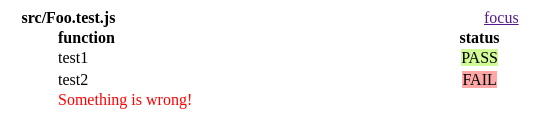

# brotest
Brotest is tool for testing code in web browser.
Brotest support asynchronous programming and hot reloading. 
Scanning folder to find and automatically added file that contains **.test.** in file name.
Brotest give possibility to focus on class that current working on. 
Thanks to that entire test for project in not reloading when code is editing.

## config

Brotest require to set folder where source code is.
In this example is **src**.
**package.json**
```js
  "scripts": {,
    "test": "npx brotest src",
  },
```

## usage
Ich test must contain **.test.** in file name. In files must by set **export default class**.
Ich public method in class must contain assert parameter. Assert is callback for function that is responsible to check if test is correct.
In assert first argument must by boolean, second is string that is optional. When first argument is set to **true** test display as ok. When is set to **false** is display as bad. When status is bad, optional message is shown.

## example

```js
export default class {
  test1(assert) {
    //test pass
    assert(true)
  }

  test2(assert) {
    //test failed
    assert(false, "Something is wrong!")
  }
}
```
